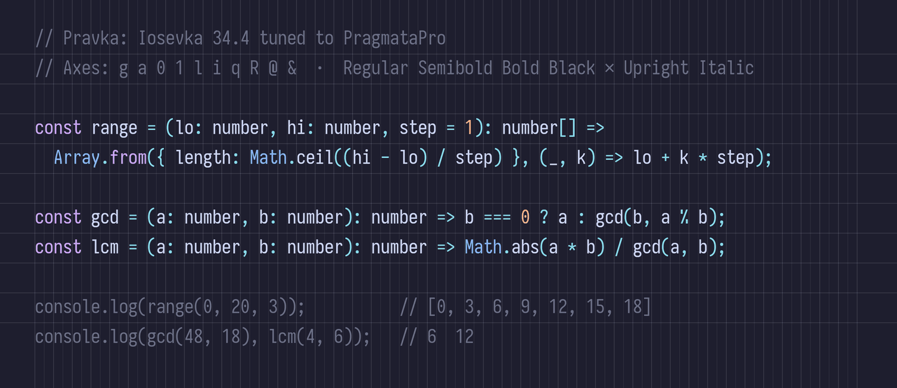
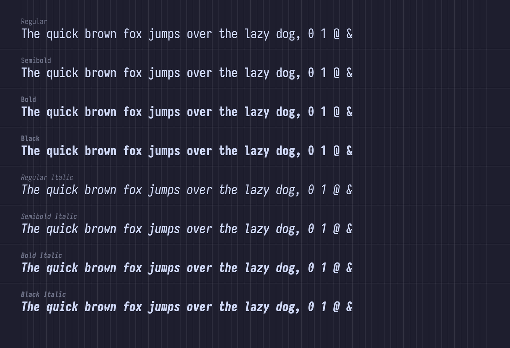
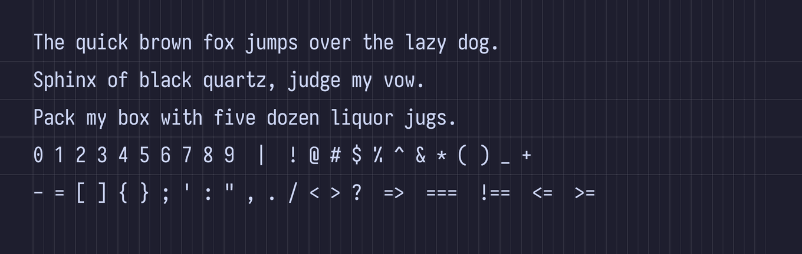
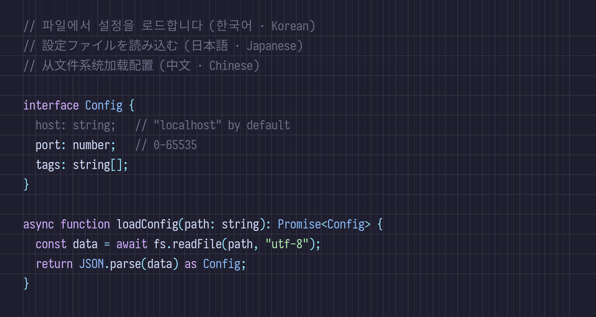
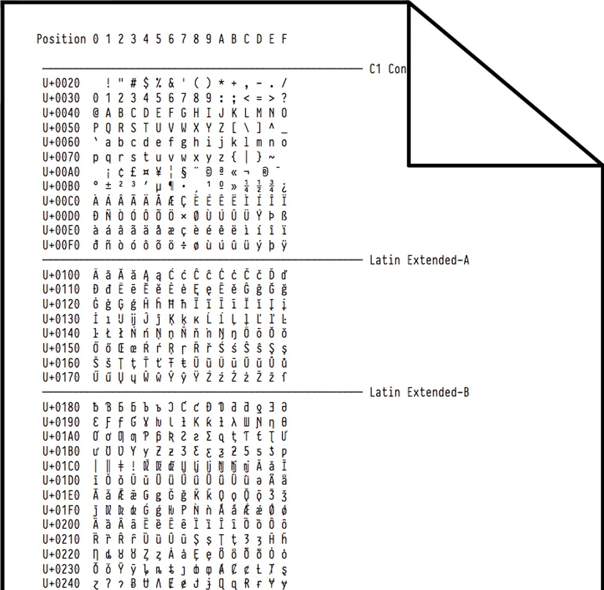
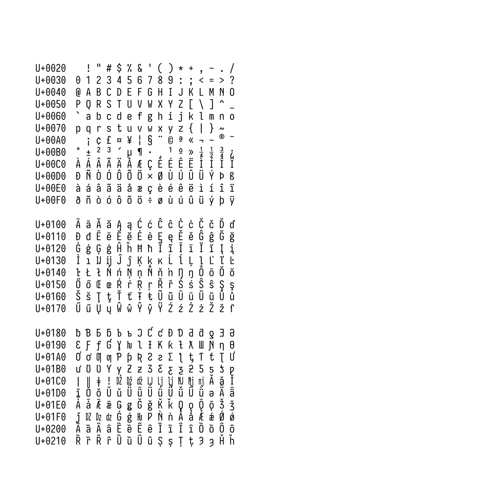
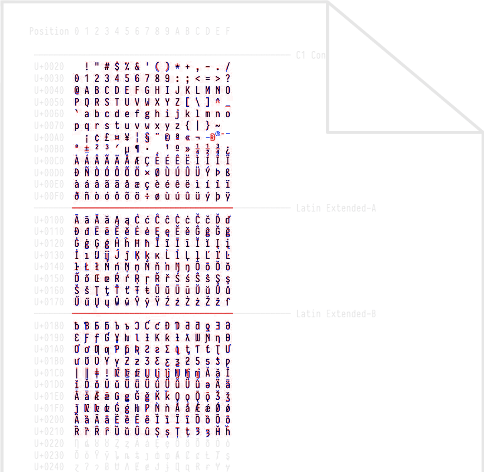

# Pravka

[](https://fsd.it/shop/fonts/pragmatapro/)

A free, open-source monospace font: an Iosevka 34.4 custom build visually tuned to PragmataPro.









## Comparison with PragmataPro

Per-glyph comparison against the [official PragmataPro specimen](https://fsd.it) (Basic Latin + Latin-1 + Latin Extended):

| PragmataPro | Pravka | Diff |
|:---:|:---:|:---:|
|  |  |  |

See [COMPARISON.md](COMPARISON.md) for per-block comparisons (punctuation, arrows, math operators, box drawing, symbols, and more). For a deeper local check, `pravka compare chars --range <lo-hi>` builds a scored per-glyph diff report for any codepoint range (up to U+100620) from fsd.it's `All_chars.png`, font-free; output under `dist/reports/chars/`.

## What is this

PragmataPro is a paid monospace font. Pravka is a free approximation built on [Iosevka](https://github.com/be5invis/Iosevka) SS08, with metric overrides and per-character variant selections tuned to match PragmataPro's glyph shapes.

**Pravka does not contain any PragmataPro outlines or data.** The reference font was used only as a visual benchmark, never extracted or redistributed.

## How it works

A greedy axis-by-axis search finds the best Iosevka variant for each of 10 character axes:

| Axis | Optimized variant |
|------|-------------------|
| `g` | `double-storey` |
| `a` | `double-storey-serifless` |
| `0` | `oval-dotted` |
| `1` | `no-base` |
| `l` | `zshaped` |
| `i` tittle | `round` |
| `q` | `straight-serifless` |
| `R` | `curly-serifless` |
| `@` | `fourfold-solid-inner` |
| `&` | `upper-open` |

For each candidate, Iosevka is compiled and the affected glyphs are rasterized and compared against the reference using a composite score (pixel mismatch + L2 + SSIM). The best-scoring variant is kept before moving to the next axis.

## Build

**Prerequisites:** [Bun](https://bun.sh) and Node.js/npm (both are required: Bun runs the tooling, npm compiles Iosevka). All tooling is exposed through one CLI: `bun src/cli.ts <command>` (or `bun link` to install it as `pravka`). Run `bun src/cli.ts --help` to see every command.

```sh
# 1. Download Iosevka 34.4 source and install its dependencies
bun src/cli.ts build setup

# 2. Build the font from the current best recipe
bun src/cli.ts build font

# Output TTFs land in dist/fonts/<hash>/
```

Built TTFs include Regular, Semibold, Bold, and Black weights, each in Upright and Italic (8 files total).

## Packaging a release

```sh
bun src/cli.ts release build            # one-shot: cleans dist/release/ and runs every stage
                                        # → {Pravka,PravkaNerdFontMono}/{ttf,otf,woff2}/ + zips + SHA256SUMS
```

`release build` runs all stages in order; each stage is also a standalone subcommand for incremental rebuilds:

| Stage | Purpose |
|-------|---------|
| `release ttf` | Build each family's TTFs and add PragmataPro-compatible Fullwidth Forms coverage (plain = rename, nerd = FontForge patch) |
| `release otf` | Convert the built TTFs to OTF (FontForge) |
| `release woff2` | Compress the built TTFs to WOFF2 |
| `release package` | Zip each family directory and write `SHA256SUMS` |

Produces two families (**Pravka** and **Pravka Nerd Font Mono**, `--mono` patched), each in **TTF, OTF, WOFF2**, plus versioned zips and `SHA256SUMS`. Useful flags: `--family plain|nerd|both`, `--formats ttf,otf,woff2`, `--font-dir <prebuilt>`, `--version <v>` (defaults to `package.json`).

- Release TTF/OTF and the Nerd Font family use [`fontforge`](https://fontforge.org) (for Fullwidth Forms coverage, OTF conversion, and the Nerd patcher), provided by the dev flake, so run inside `nix develop`. The Nerd Fonts `FontPatcher` is downloaded and cached automatically. `dist/release/` is gitignored; upload its zips to GitHub Releases.

## Running the search

The search scores candidate builds against PragmataPro by cropping the public fsd.it
[`All_chars.png`](https://fsd.it/pragmatapro/All_chars.png) specimen; no PragmataPro
font file is needed; the image is downloaded and cached automatically.

```sh
bun src/cli.ts search                 # greedy search, 2 passes; updates src/shared/recipe/recipes/current-best.toml
bun src/cli.ts glyph report           # generate HTML diff report in dist/reports/
```

## Regenerating specimen images

```sh
bun src/cli.ts showcase specimen      # writes docs/assets/showcase/*.png
bun src/cli.ts compare docs           # writes docs/assets/compare/**/{pragmatapro,pravka,diff}.png
```

CJK text (Korean, Japanese, Chinese) is rendered via [Noto Sans Mono CJK](https://github.com/notofonts/noto-cjk) as a fallback alongside Pravka. The font (Variable OTC, pinned to tag `Sans2.004`) is downloaded and cached automatically under `vendor/noto-cjk/`; set `PRAVKA_CJK_FONT` to use a local file instead.

## License

Pravka is a derivative of Iosevka and is released under the [SIL Open Font License 1.1](LICENSE). PragmataPro is not included in this repository in any form.
